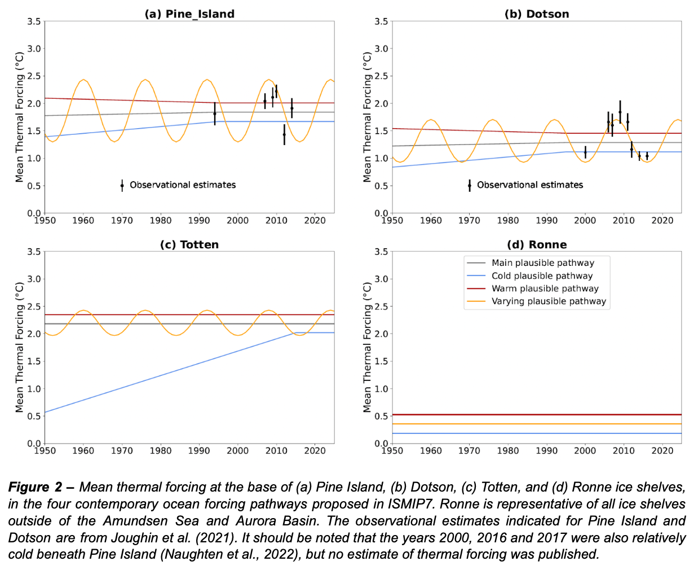

# Ocean forcing for the observation-based contemporary ice-sheet simulations

## 0. Content of this repository

* **build\_contemporary\_AIS\_ocean.py** is used to create the netcdf files for 4 plausible pathways from 1950 to 2025 for thetao, so and tf.

* **calculate\_TF\_ice\_drafts.py** is used to interpolate the thermal forcing at the ice draft depths, which is done to check the results.

* **plot\_TF\_time\_series\_per\_ice\_shelf\_contemporary.py** is used to plot the time series of cavity-averaged thermal forcing below a few ice shelves.

## 1. Motivation
ISMIP6 has been widely criticized because the ice-sheet simulations generally did not represent the observed mass loss (Aschwanden et al., 2021). A part of the ice-sheet model biases over the recent period may be attributed to either oceanic and atmospheric biases in the CMIP models or to the ice sheet models themselves. The ISMIP7 SSC has therefore decided to propose a forcing set for the recent decades (1950-2025) that is not affected by the CMIP model biases.This is challenging for the ocean forcing around Antarctica because many locations have never been monitored before the 1990s or 2000s. Based on the scientific literature, we can nonetheless propose plausible temperature and salinity trajectories for some key regions.

## 2. Method
Given the lack of observations in the early period, we are not confident that we can propose a unique ocean pathway. We therefore propose a main plausible pathway, a cold plausible pathway and a warm plausible pathway. We also propose a varying plausible pathway that is mostly designed for scientific exploration and sensitivity analyses.

Two regions around Antarctica have been characterised as experiencing both important mass loss from the grounded ice sheet and the presence of circumpolar deep water (CDW) in the ice shelf cavities: the Amundsen Sea and the ocean facing the Aurora basin. These two regions are therefore treated differently from the other regions.

For all regions except the Amundsen Sea and the Aurora basin, our approach for the main plausible pathway consists of applying the present-day climatology to the entire period (gray in Fig. 2d). Following the estimate of Jourdain et al. (2020), we consider that the uncertainty on the ocean temperature climatology is typically ±0.17 °C, so that the cold plausible pathway is defined as the present-day climatology minus 0.17 °C (capped by the local freezing temperature), while the warm plausible pathway is defined as the present-day climatology plus 0.17 °C. It is indeed very likely that all the ice-shelf cavities that are currently cold have also been cold since 1950. Ocean observations since the late 1970s in front of Filchner and Ronne ice shelves support the absence of strong temperature changes (e.g., Foldvik et al., 1985). In the Ross Sea, the ocean temperature has been warming by only 0.002 °C per decade since the late 1950s (Jacobs et al., 2022). A more significant freshening of –0.024 PSU per decade has also been observed in the Ross Sea, but it is relatively uniform on the vertical (Jacobs et al., 2022) and we don’t expect a significant impact of this freshening on ice shelf melt rates. CDW is currently present at several locations on both sides of the Antarctic Peninsula, and there are some indications of water warmer than the surface freezing point as early as 1898 (De Deckker 2018), so extending the present-day climatology back to 1950 also seems reasonable there. We also claim that the Peninsula region is not an important contributor to changes in sea level (e.g., Seroussi et al., 2020), so that reconstructing the ocean forcing in detail along the Peninsula coastline is not a priority for ISMIP7.

In the Eastern Amundsen Sea, CTD measurements indicate a mean thermal forcing beneath Pine Island ice shelf varying between 1.2 and 2.4°C since 1994, and a mean thermal forcing beneath Dotson ice shelf varying between 1.0 and 2.0°C since 2000 (Joughin et al., 2021; Dutrieux et al., 2014; Jenkins et al., 2018). A regional ocean model forced by an ensemble of runs from the CESM2 model (Naughten et al., 2023) simulates that temperature averaged over the Amundsen continental shelf and the depth range 200–700 m undergoes a trend between –0.19 and +0.62 °C/century over the historical period (median trend: +0.14 °C/century; mean trend: +0.24 °C/century). Last but not least, there is multiple evidence that the Amundsen Sea in front of Pine Island and Thwaites was anomalously warm in the 1940s with a resulting grounding line retreat (O’Connor et al. 2023 and references therein; Smith et al., 2017; Clark et al., 2024). The flux at the grounding line has been increasing since the late 1970s for several glaciers in the Amundsen Sea (Mouginot et al., 2014), but given the possibility of a self-sustained grounding line retreat, it is difficult to conclude that the entire period since the 1940s has remained warm (e.g., Reed et al., 2024).

In view of all this, for the Amundsen Sea (Cosgrove to Dotson, i.e. “G-H” IMBIE basin), we propose that the main plausible pathway is a trend of 0.0014 °C/yr that meets the climatology value in the year 1995 and remains constant afterwards (see corresponding thermal forcing in gray in Fig. 2a,b). The year 1995 is chosen because the climatology is expected to be broadly representative of 1995–2025, and because no significant trend has been identified over the observed period. The cold plausible pathway is constructed similarly but with a trend of 0.0062 °C/yr that meets the climatology minus 0.17°C in 1995. The warm plausible pathway is constructed similarly but with a trend of –0.0019 °C/yr that meets the climatology plus 0.17 °C in 1995. Given the negative trend, the warmest plausible pathway gives a slightly warmer state in 1950 than presently, which corresponds to the indications from sediment analyses. The trends of Naughten et al. (2023) appear to be relatively uniform with depth, so for a sake of simplicity, we propose to apply the perturbation uniformly on the vertical. We also propose to keep the salinity at the value of the present-day climatology for all experiments, as we expect the salinity changes to have relatively minor effects.

For the part of the Amundsen Sea facing the Getz ice shelf (“F-G” IMBIE basin), we propose to do something half way between the Amundsen Sea and the Ross Sea, i.e. use the same method as in the rest of the Amundsen Sea, but with halved trends.

There is much less scientific background on the past oceanic conditions in front of the Aurora basin (“Cp-D” IMBIE basin). The central Totten trough, facing the Aurora basin, has been experiencing the presence of CDW since the first CTD measurements in 2015, and even more since 2018 (Hirano et al., 2023). The analysis of undulations at the surface of Totten ice shelf in satellite images suggest that the ocean was relatively warm from approximately 1920 to 1965 and from approximately 1980 to present-day, with a colder period from approximately 1965 to 1980 (Miles et al., 2025). However, it remains difficult to translate this into ocean temperature variations. We therefore prescribe a relatively broad range: the main plausible pathway consists of applying the present-day climatology all the way from 1950 to 2025 (Fig. 2c). The cold plausible pathway has a constant temperature at the present-day climatology minus 0.17 °C after 1995, and temperature decreases backward in time from 1995, to reach the surface freezing temperature in 1950. In this case, salinity also evolves from a uniform profile in 1950 (average of present-day salinity profile) to the climatology after 1995. The warm plausible pathway consists of the climatology plus 0.17 °C.

## 3. (Multi-)decadal variability
In the proposed plausible pathways, we did not attempt to capture the decadal or multi-decadal variability due to a lack of observations, and because the effect of ocean decadal variability on the overall ice sheet mass loss is thought to be relatively small. While ice stream velocities seem to respond to ocean variability (Jenkins et al 2018), the variability in ice sheet thinning propagates upstream (Konrad et al 2017) and so is muted when averaged over the catchment (Shepherd et al 2019).

There are nonetheless a few aspects that may be sensitive to decadal variability: (i) most melt parameterisations depend non linearly on the thermal forcing, so for a given mean temperature, a pathway with more variability will generate higher melt rates overall; (ii) variability may provide high melt rates for short periods that can be required to trigger a self-sustained grounding line retreat that possibly keeps going during the following cold period, so the warm extrema may matter more than the mean; (iii) depending on the initialisation method, ice sheet models may be more or less sensitive to temperature variability.

For this reason, we additionally propose a varying plausible pathway for the Amundsen Sea and Aurora basin (orange in Fig. 2). In this pathway, the depth of the thermocline evolves as a cosine waveform that broadly matches the recent observations (Jacobs et al., 2013; Dutrieux et al., 2014; Jenkins et al., 2018; Hirano et al., 2023). The thermocline depth is varied by uplifting and lowering the entire climatological T,S profiles, by ±150m in the Eastern Amundsen Seam and by ±100m in the Getz and Aurora basins. For the three basins, the cosine has a 16-year period, and the thermocline is highest in 1960, 1976, 1992, 2008, and 2024.

## 4. Comments on the ocean conditions for ice sheet initializations before 1950
There are multiple lines of evidence that warm ocean anomalies triggered ice sheet changes one or two decades before 1950 in the Amundsen Sea and in front of the Totten ice shelf. What happened between the pre-industrial era and the mid-20th century remains unknown and a matter of debate. On the one hand, Caillet et al. (2023) suggested that a pre-industrial climate would give buoyancy fluxes at the surface of the Amundsen Sea that could lead to cold ice-shelf cavities. This result was nonetheless based on relatively idealised atmospheric perturbations in ocean simulations. On the other hand, it is sometimes suggested that the landscape of the Amundsen Sea prior to 1940 (a deglaciated embayment) would not be compatible with cold ocean conditions. It is indeed argued that no such deglaciated cold bay currently exists around Antarctica, although no embayment is perfectly comparable to the Amundsen Sea.

In any case if an ice-sheet modelling approach requires starting from a steady state, we do not recommend reaching such a steady state with constant 1950 forcing. Instead, we recommend either (i) extending the temperature trends discussed for the Amundsen Sea and Aurora basin back to 1900 or 1850, ideally with a warm mid-20th century anomaly to trigger the 1940s retreat, or (ii) using a bias-corrected CMIP simulation in pre-industrial conditions. Finding the exact way to do so is considered as a matter of research for individual modelling groups.
